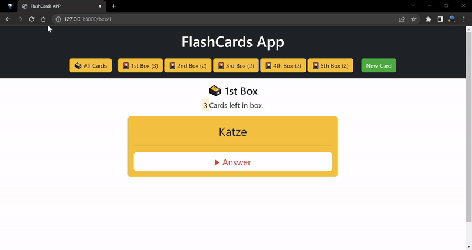

# Django4 Cards APP
This app made for learning new words or something else

## How to use?
This app works with Leitner System. There are 5 boxes for cards. The learner should begin with the first box when new things adding.
When the learner recall the answer, the card moves to next box. If they fail, the card moves to first box.

You can add new cards with "New Card" button at top of the page. 
  
<pre>
                   
</pre>

---

In the Homepage, the learner can see all cards, but in box pages cards are coming randomly.  

---

Arbeit word moved from 1st box to 2nd box.   

---

Hilfe word moved form 4th box to 1st box.   

---

The learner can edit the card.   

